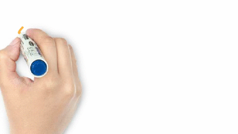
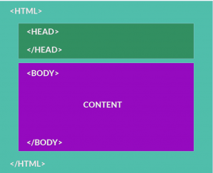

> :point_up: Si en el capítulo anterior decíamos que las casas, tiendas y edificios son páginas web, entonces el código HTML sería los planos del edificio.


## HTML es el esqueleto del sitio web


Todas las páginas web tienen HTML, es la estructura base de TODO. Imagínatelo como el esqueleto de una página o como los pilares de una construcción.

HTML te permite dividir la información del sitio web en partes: header, title, content, footer, subtitle, etc. Luego, con CSS, podrás hacer la página hermosa y con JavaScript la harás interactiva.

Originalmente, los navegadores solo podían interpretar HTML, las páginas web eran sencillas y no se usaba CSS o JavaScript.  Un sitio web era un simple documento de texto plano con los elementos típicos que cualquier documento de Word tiene: títulos, listas de viñetas, párrafos, etc.


## Sintáxis del HTML: Todo es `<Tags> ` o etiquetas.



¿Recuerdas que Internet trabaja solo con texto?
 
En ese sentido, HTML es un leguage que utiliza etiquetas (`<tags>`) para representar los elementos que una página web debería de tener. Un tag es simplemente una palabra que comienza con `< >` y termina con `</ >`. Todos los tags se deben de abrir y cerrar, (los tags de cierre siempre preceden al elemento con `/`)

Hay 2 dipos diferentes de tags:

+ Tags con contenido: cuando hay contenido entre ambos tags, debes de cerrarlos con (`</tag>`). Por ejemplo, para marcar un tag de texto como un párrafo, debes empezar con con (`<p>`) y cerrarlo al final con (`</p>`). 

+ Tags sin contenido: son tags independientes sin tags de cierre (`</ >`). Por ejemplo, el tag para un salto de línea es (`<br>`).

## Atributos

Una vez definida la  `<tag>`, podemos describir con más detalle su comportamiento asignándole atributos a esas `<tag>`.  Por ejemplo, si queremos que nuestro documento/página HTML tenga un link a otra página, utilizamos la etiqueta `<a>` y le asignamos un atributo llamado **href**, que permite especificar el URL de la otra página a la que queremos hacer el enlace.

```html
<a href="google.com">Haz clic aquí para ir a Google.com</a>
```


En teoría, tú debes utilizar [una de estas tags](https://github.com/breatheco-de/content/blob/master/src/assets/assets/assets/Cheat-Sheet-HTML.jpg?=true), no puedes inventar tus propias etiquetas porque el navegador no sabría cómo interpretarlas. Sí, debes conocer el significado de cada **etiqueta HTML** para utilizarlas sabiamente… ¡pero no te preocupes que no hay muchas! 🙂

Para el título principal, o el título más grande, se utiliza la etiqueta `<h1>`. Por ejemplo: una tienda en línea podría tener una sección para la categoría de electrónicos, en ese caso un título coherente seria “Artículos Electrónicos” y la tag  `<h1>` la escribiríamos de la siguiente manera:


```html
 <h1>Artículos Electrónicos</h1>
```


## Tags Anidadas :
Por último, es importante que una tag pueda tener una o más tags en su contenido.  Por ejemplo, si quisiéramos darle un estilo en cursiva a la palabra “electrónicos” debemos acompañar esa palabra con la etiqueta `<i>`:

```html
 <h1>Artículos <i>Electrónicos</i> - Tags</h1>
```

 ## Espacios vacíos y saltos de línea

Los espacios vacíos (o en blanco) y los saltos de línea son omitidos por el navegador al momento de interpretar el texto. Si escribimos cinco espacios en blanco seguidos, o uno solo, el navegador lo interpretará de la misma manera. Si queremos un salto de línea, debemos usar la etiqueta `<br>`.  Si queremos más "espacio", necesitamos insertar `&nbsp;` por cada espacio en blanco (sí, es raro, pero es así).

**Estas tres alternativas se van a ver iguales (espacios y saltos de lineas van a ser ignorados):**

```html
<tag>Hello</tag><tag>World</tag>
```

Los saltos de linea son ignorados:

```html
<tag>Hello</tag>
<tag>World</tag>
```

Los espacios son ignorados:

```html
<tag>Hello</tag>               <tag>World</tag>
```


## Estructura de página


Todas las páginas deben empezar con la declaración del  `<DOCTYPE! Html>`, seguida por las etiquetas que contienen el `<head>` y por último el contenido del `<body>`. Estas tags **obligatoriamente** contienen otras tags dentro de ellas que son anidadas, y eso es así porque separan la página en dos pedazos principales: el HEAD (la cabeza) y el BODY (el cuerpo):


```html
<!-- Siempre debemos empezar con una tag HTML para demostrarle al navegador que este es un documento en formato HTML. -->
<!DOCTYPE html>
<html>
   <head>
   <!-- Dentro de la tag head vamos a definir toda la información que requiere el navegador ANTES de empezar a interpretar la página. -->
   </head>
   <body>
   <!-- Dentro de la tag body vamos a definir el contenido de la página. -->
   </body>
</html>
```

Vamos a simular el pensamiento de un navegador: Imaginemos que una persona en su navegador (lado del cliente) está solicitando visualizar la página web: “breatheco.de”

+ El servidor abrirá un archivo HTML por defecto en el servidor. Probablemente sea index.html.
+ Luego, leerá el contenido y lo interpretará como un HTML (porque la extensión del archivo es index.html).
+ La persona no verá el texto que contiene el archivo, en cambio verá una interpretación visual de ese texto.

 Como ya sabemos, dicha página va a contener, por lo menos, los siguientes tags:

  

|**Nombre**   |**Tags**   |**Descripción**   |
|:----------|:----------|:-----------------|
|HTML       |`<html>`   |Debemos empezar aclarándole al navegador que esto es un documento HTML. También podemos especificar la versión de HTML que estamos utilizando.   |
|Head       |`<head>`   |Todo lo que esté dentro del HEAD no lo verá el usuario. Es la parte de la página en donde le dices al navegador en qué idioma está hecha la página, de qué se trata, cargas las fuentes (font type) necesarias, defines el ícono que va a tener la pestaña en el navegador y muchas otras cosas realmente importantes.   |
|Body       |`<body>`   |Aquí vas a colocar todo el contenido del documento que verá el usuario final.<br>Si esto fuera MS Word, el body marcaría el inicio de tu página, la primera línea del texto del documento.

### El \<head\> es como el sobre de una carta.

Leemos el sobre de una carta para conocer información sobre la carta en sí misma, no sobre el contenido. En el sobre puedes enterarte de quién la escribió, en que idioma está, de dónde viene, etc.

En el caso de HTML, `<head>` puede contener los siguientes tags (entre otros menos importantes):

|**Nombre**   |**Tag**   |**Descripción**   |
|:----------|:---------|:-----------------|
|Title      |`<title>`   |El título aparece en la ventana del navegador, también es utilizado cuando compartes la página en las redes sociales: Facebook, Twitter, Instagram, etc. Todas esas redes utilizan el título de la página como extracto por defecto para compartir cuando algún usuario copia el URL de tu página en su muro. Por último, es fundamental para SEO (Optimización para buscadores), ya que, Google le da mucha importancia dentro del contenido.   |
|Meta       |`<meta>`   |Las etiquetas meta describen al documento. Se utilizan para especificar cosas como: autor, título, fecha, palabras clave, descripción, etc. Los buscadores aman las meta etiquetas porque les permite entender mejor el contenido antes de leerlo.   |
|Link       |`<link>`   |Tiene como finalidad enlazar a la página con hojas de estilos CSS. Cuando veamos el capítulo de CSS, aprenderemos a crear hojas de estilos y podremos importarlas utilizando esta etiqueta.   |
|Style      |`<style>`   |Si no queremos o no podemos importar una hoja de estilo CSS, también tenemos la posibilidad de definir estilos en el propio documento HTML dentro de este tag. Es una práctica que no recomendamos en casi ningún escenario, solo deberías usarla cuando te veas obligado.   |
|Script     |`<script>`   |Se utiliza para agregar código JavaScript a la página. Todo el código JavaScript debe estar siempre contenido dentro de estas etiquetas que también se puede utilizar en el BODY si así lo deseamos. La diferencia es que cualquier código JavaScript que coloquemos en una etiqueta style ubicada en el body, no estará disponible al momento de iniciar la ejecución de la página (justo en eso es que nos ayuda el HEAD).   |

### El \<body\> es similar a cualquier documento de MS Word

Bien, ahora que conocimos la estructura general y necesaria de la página, vamos a revisar cuáles son los tags que podemos y debemos utilizar para definir el contenido de la misma.

Recuerda -por quinceava vez- que una página web es un… ¡documento de texto! Así es. Si has pensado en la respuesta antes de leerla… ¡estás entendiendo! y si no es así, pues no te preocupes, que no conozco a nadie que haya entendido HTML y CSS tan rápidamente ;).

Veamos ahora en qué se compara un website con un documento de Word:

<before-after width="500px" before="images/f2021d8d-193d-4482-b189-ae0005b1bd88.png" after="images/8e339149-97ae-4b15-ba59-a3ddf3777525.png" /></before-after>

Las etiquetas más utilizadas dentro del `<body>` de un documento HTML son las siguientes:

|**Nombre**   |**Tags**   |**Descripción**   |
|:----------|:----------|:-----------------|
| Head       |H1, H2, H3, etc.   |Define los headings y subheadings de la página (los headings no son lo mismo que el título; el título es utilizado por el navegador y se define en el tag title).<br> `<h1>Este es un heading</h1>`   |
|Párrafo   |P   |Esta etiqueta separa el texto que contiene con un margen superior e inferior. De esta manera simula exactamente el comportamiento de un párrafo en un documento.`<p>ejemplo de un párrafo</p>`   |
|Lista   |UL, OL   |Las listas son fundamentales en un documento, en el caso de HTML tenemos dos tags que podemos usar para listar contenido:<br><br> <li>OL: Que nos da una lista numerada (pone numeritos delante).</li><br><li>UL: Que nos da una lista sin números (pone puntos por delante).<br><br>`<ol>`<br>`<li>Elemento 1</li>`<br>`<li>Elemento 2</li>`<br>`</ol>`   |
|Imagen  |img   |Nos permite agregar imágenes al documento, pueden ser imágenes PNG, JPEG, GIF y SVG principalmente .<br>``
|Link (Anchor)   |a   |A veces queremos conectar una o mas páginas entre ellas, enviar al usuario a otra página para continuar con el flujo o incluso poder enviarlo a otra sección del mismo documento (tal como ocurre en el menú de este curso). Para eso está la tag “Anchor”.<br>`<a href="url to resend">this is a heading</a>`   |
|Negrita   |strong o b   |Para resaltar un texto en negritas.<br>`<strong>este es un heading</strong>`   |
|Cursiva   |i   |Para colocar un texto en formato cursiva. <br>`<i>este es un heading</i>`   |
|Salto de Linea  |br   | 	Para saltar el texto o contenido a la línea siguiente (similar al `shift+enter` en MS Word.)<br>`<br></br>`   |
|Tablas   |table   |Las tablas fueron diseñadas para presentar datos de una forma legible y coherente. Tienen una headers (th), filas (tr) y columnas (td).<br><br>`<table>`<br>`<tr><th>Columna 1</th><th>Columna 2</th></tr>`<br>`<tr><td>Datos 1</td><td>Data A</td></tr>`<br>`<tr><td>Datos 2</td><td>Datos B</td></tr><br>`<br>`<tr><td>Datos 3</td><td>Datos C</td></tr>`<br>`</table>`   |

> :link: [Haz clic aquí](https://www.w3schools.com/tags/ref_byfunc.asp), para más tags HTML.

## Los atributos (propiedades)

Ya sabemos que cada  `<tag>` tiene un comportamiento diferente. Gracias a ellas podemos cambiar el tamaño de la letra - como ocurre con los headings - agregar márgenes entre párrafos, enumerar elementos, etc.

Si quieres especificar más el comportamiento de una etiqueta en particular, puedes utilizar sus atributos. Para usarlos debes definirlos en el tag de apertura así:

```html

```


En este caso, estamos asignándole a la etiqueta `` la propiedad "src" que indica cual es la ruta de la imagen que debe visualizarse en este contenedor.

Cada etiqueta tiene sus propiedades -no tienes que memorizarlas, siempre las conseguirás rápidamente en Internet- pero si es bueno que revises las más importantes para que las tengas a disposición en tu mente.

Por eso hemos creado una serie de ejercicios que te explicarán mejor cada una de las propiedades importantes de los elementos más utilizados de HTML.  

**Aplausos, ¡Ya sabes HTML!!!**  

¡¡Estamos orgullos@s!!! 🙂

Acabas de aprender lo esencial para realizar una página web como se hacía en 1999. Ahora tenemos unas pocas semanas mas para ponerte al día con todo lo que ha pasado en estos últimos 20 años.  ¡Ya puedes decir que sabes hacer un website!

HTML tiene muchísimos más tags y también tiene una nueva versión llamada HTML5. Otra vez, no te preocupes, todo eso lo **aprenderás** en las próximas lecciones para que hagas páginas web hermosas (gracias a CSS) y con interacción (Gracias a los formularios y JavaScript) ¡¡Para eso es que estamos acá!!


